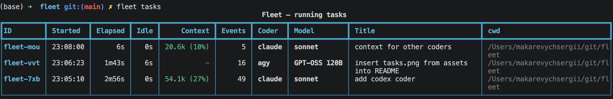
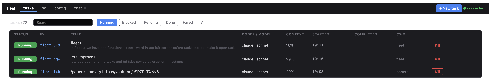

# fleet — Python supervisor for running coding agents in parallel

<p align="center">
  
</p>

<p align="center">
  <a href="https://docs.google.com/presentation/d/1O_pXyKdtpRG2ORD1xw7svifjpCol96wIVvOU6kOMDlI/edit?usp=sharing">
    
  </a>
</p>

`fleet` is a lightweight Python supervisor that claims tasks from a
**centralized** [beads](https://github.com/gastownhall/beads) queue and runs
them in parallel through a coder (`claude`, `agy`, or `codex` CLI) in a headless loop. Each task
remembers the project working directory it was created in, plus an optional
per-task coder/model override, so a single supervisor can drive work across
many projects — and across multiple agent backends — spawning many concurrent agents - from one machine.

<p align="center">
  
</p>

Fleet ships with a full-featured web UI (`fleet serve`) that covers the entire agent lifecycle — create and configure tasks, monitor live progress and logs, and chat with blocked agents via the Chat tab, all from a single dashboard.

<p align="center">
  
</p>

---

## Contents

- [Installation](#installation)
- [Quick start](#quick-start)
- [How it works (centralized model)](#how-it-works-centralized-model)
- [First-run setup](#first-run-setup)
- [Command reference](#command-reference)
  - [`fleet init`](#fleet-init)
  - [`fleet ready`](#fleet-ready)
  - [`fleet show <id>`](#fleet-show-id)
  - [`fleet tasks`](#fleet-tasks)
  - [`fleet task <id> {log|plan|knowledge}`](#fleet-task-id-logplanknowledge)
  - [`fleet log [N]`](#fleet-log-n)
  - [`fleet bd <args...>`](#fleet-bd-args)
  - [`fleet run`](#fleet-run)
  - [`fleet serve`](#fleet-serve)
  - [`fleet config show` / `fleet config set`](#fleet-config-show--fleet-config-set)
  - [`fleet telegram setup` / `fleet telegram status` / `fleet telegram test`](#fleet-telegram-setup--fleet-telegram-status--fleet-telegram-test)
  - [`fleet ask-human <command>`](#fleet-ask-human-command)
- [Configuration reference](#configuration-reference)
- [Telegram channel notifications](#telegram-channel-notifications)
- [Inbound task creation from Telegram](#inbound-task-creation-from-telegram)
- [Answering chat questions from Telegram](#answering-chat-questions-from-telegram)
- [The ask_human question broker (bundled MCP server)](#the-ask_human-question-broker-bundled-mcp-server)
- [Adding a custom coder](#adding-a-custom-coder)

---

## Installation

Install `fleet` as a global tool so it is on `$PATH` from any directory:

```bash
git clone https://github.com/sermakarevich/fleet.git
uv tool install --editable ./fleet
uv tool update-shell      # if ~/.local/bin is not on PATH yet
```

Then `fleet --help` should work from anywhere. Use `uv tool upgrade fleet`
later to pick up new dependencies; code edits are live because the install is
editable.

Requires:
- Python ≥ 3.11
- [`uv`](https://docs.astral.sh/uv/) on your `PATH`
- [beads (`bd`)](https://github.com/gastownhall/beads) on your `PATH`
- `git` on your `PATH` (beads stores its database inside a git repo)
- At least one coder CLI on your `PATH`: `claude` (Claude Code), `agy`, or `codex` (OpenAI Codex CLI)

---

## Quick start

```bash
fleet init                                          # initialize ~/.fleet (beads DB + default config)
fleet config set max_concurrent=3                   # cap how many agents run in parallel
cd /path/to/your/project                            # any project you want the agent to work in

# Title + description:
fleet bd create --title "add codex coder" \
    --description "wire the OpenAI codex CLI into fleet"

# Pin coder/model for this task only:
fleet bd create --coder agy --model "GPT-OSS 120B" \
    --title "insert task.png from assets into README.md" \
    --description "promote the screenshot to the Quick start section"

# Positional-title shortcut (cwd is captured automatically):
fleet bd create "context for other coders"

fleet run start                                     # start the supervisor as a background daemon
fleet tasks                                         # render a live table of in-progress tasks
```

<p align="center">
  
</p>

See [First-run setup](#first-run-setup) and the [Command reference](#command-reference)
for the full story (per-task coder/model overrides, log locations, …).

---

## How it works (centralized model)

There is **one** fleet home directory on your machine — `~/.fleet` by default,
override with `$FLEET_HOME` if you like.

```
~/.fleet/
├── .beads/                       # the centralized bd queue (single Dolt DB)
├── runtime.toml                  # supervisor config
├── logging/                      # supervisor logs (fleet-<date>.jsonl)
└── tasks/<task_id>/
    ├── task.json                 # per-task metadata: cwd, coder, model
    ├── log.jsonl                 # per-task supervisor log
    ├── log.stderr                # raw subprocess stderr
    ├── events.jsonl              # per-task structured events (agent reads on resume)
    ├── .failures                 # failure counter (drives retries)
    └── artifacts/
        ├── PLAN_AND_STATUS.md    # agent-owned plan + progress
        └── KNOWLEDGE.md          # agent-owned persistent notes
```

Each task records the project working directory the agent should run in,
plus the optional coder/model override, inside
`$FLEET_HOME/tasks/<task_id>/task.json`
(`{"cwd": "/abs/path", "coder": "claude", "model": "sonnet"}`).
The supervisor — which can be started from anywhere — claims tasks from
the central queue and runs each agent subprocess in that cwd. All per-task
artifacts and logs live under `$FLEET_HOME/tasks/<task_id>/`, so they're
preserved across project moves and shared between coders. If no `task.json`
exists for a task, the supervisor falls back to running the agent in
`$FLEET_HOME` itself.

Create tasks with the `fleet bd` passthrough and write `task.json` next to
the new task ID (see "Create your first task" below).

---

## First-run setup

### 1. Initialize the fleet home

```bash
fleet init
# → Fleet home initialized at /Users/you/.fleet
```

This runs `bd init` inside `$FLEET_HOME` and writes a default
`runtime.toml`. Idempotent — safe to re-run.

### 2. Create your first task

Run `fleet bd create` from inside the project you want the agent to work
in — your shell's cwd is captured automatically and stored alongside the
new task:

```bash
cd /path/to/your/project
fleet bd create --title "Implement feature X"
# → Created fleet-abc: Implement feature X  [cwd: /path/to/your/project]

# Pin coder/model for this task only (overrides config defaults):
fleet bd create --coder agy --model opus --title "Heavy refactor"
# → Created fleet-def: Heavy refactor  [cwd: /…, coder: agy, model: opus]
```

`fleet bd …` forwards verbatim to the `bd` CLI inside `$FLEET_HOME`, so any
flag `bd create` accepts (`--description`, `--priority`, dependencies via
`bd dep add …`, …) works the same way. For `create` specifically, fleet
also writes `$FLEET_HOME/tasks/<id>/task.json` with `{"cwd": "<your cwd>"}`
so the supervisor knows where to spawn the agent. Pass `--json` to get the
raw bd envelope back instead of the human-friendly summary line.

`--coder` and `--model` are intercepted by fleet (not forwarded to `bd`):
they're validated against the registered coders (`claude`, `agy`, `codex`)
and persisted as per-task overrides in `task.json`, applied next time the
supervisor claims the task. Always pass both together when overriding —
or omit both to inherit the config defaults.

### 3. (Optional) Override coder/model for specific tasks

By default the supervisor uses `config.coder` (default `claude`) and
`config.model` (default `sonnet`) for every task. To pin a single task to a
different coder/model — e.g. route a heavy refactor to `agy` while leaving
everyday tasks on `claude` — pass `--coder` **and** `--model` together at
create time (always specify both so the override is unambiguous):

```bash
fleet bd create --coder agy    --model opus --title "Heavy refactor"
fleet bd create --coder codex  --model o3   --title "OpenAI task on o3"
fleet bd create --coder claude --model opus --title "Tricky task on Opus"
```

The override is persisted in `$FLEET_HOME/tasks/<task_id>/task.json` and is
applied the first time the supervisor claims the task. Resolution order is
`task.coder` → `config.coder` (similarly for `model`). Confirm what the supervisor will pick with
`fleet show <task_id>` — explicit overrides are bare, while inherited
values are tagged ` (default)`. To change an override after creation,
edit `$FLEET_HOME/tasks/<task_id>/task.json` directly.

### 4. Start the supervisor

```bash
fleet run start                 # start the supervisor as a background daemon
fleet run status                # is it running? (pid + start time)
fleet run restart               # pick up code/config changes
fleet run stop                  # graceful shutdown
```

The supervisor reads from `$FLEET_HOME/.beads`, claims ready tasks, and spawns
each agent subprocess in **that task's** working directory with the
per-task (or default) coder/model resolved as described above.

---

## Command reference

### `fleet init`

```bash
fleet init
fleet init --force        # re-run bd init even if .beads already exists
```

Creates `$FLEET_HOME` (default `~/.fleet`) with a beads DB, default
`runtime.toml`, and an empty `tasks/` directory.

### `fleet ready`

```bash
fleet ready
fleet ready --limit 10
```

Lists ready tasks. Each line shows the task ID, title, and recorded cwd.

### `fleet show <id>`

```bash
fleet show fleet-abc
fleet show fleet-abc --json       # raw bd show JSON envelope
```

Prints id, title, status, cwd, effective coder, effective model, and
description. The `coder:` and `model:` lines are tagged ` (default)` when
they come from `runtime.toml` rather than a per-task override.

### `fleet tasks`

```bash
fleet tasks
fleet tasks --limit 20
```

Renders a rich table of currently in-progress tasks with: ID, started
time, elapsed, idle, peak context-window usage, event count, coder,
model, title, and cwd. Per-task overrides are bolded; values inherited
from `runtime.toml` are dim. See the screenshot in [Quick start](#quick-start).

### `fleet task <id> {log|plan|knowledge}`

```bash
fleet task fleet-abc log         # → $FLEET_HOME/tasks/fleet-abc/log.jsonl
fleet task fleet-abc plan        # → artifacts/PLAN_AND_STATUS.md
fleet task fleet-abc knowledge   # → artifacts/KNOWLEDGE.md
```

Prints the named artifact for one task. `fleet task --help` additionally
lists currently running tasks with their effective `[coder/model]`, so
you can scan valid IDs without leaving the help screen.

### `fleet log [N]`

```bash
fleet log                        # whole most-recent supervisor log file
fleet log 200                    # tail the last 200 lines
```

Prints the most recently modified `fleet-<date>.jsonl` from
`$FLEET_HOME/logging/`. `N` must be a positive integer when supplied.

### `fleet bd <args...>`

Forwards arguments verbatim to the `bd` CLI, executed inside `$FLEET_HOME`.
This is the recommended way to drive the centralized beads queue from any
directory.

```bash
fleet bd create --title "Implement feature X" --json   # → {"data": {"id": "fleet-abc", …}}
fleet bd create --title "Refactor parser" \
    --description "Extract tokenizer to its own file"
fleet bd dep add fleet-newtask fleet-abc               # add dependencies
fleet bd list                                          # list every task in the central DB
fleet bd list --status=blocked                         # filter by status
fleet bd comment fleet-abc "note"                      # comment on a task
fleet bd dolt push                                     # push the beads data to your git remote
fleet bd prime                                         # show beads workflow help
fleet bd --help                                        # bd's own --help (not fleet's)
```

The exit code of `bd` is propagated. All flags are passed through unmodified,
so `fleet bd` behaves exactly like running `bd` from inside `$FLEET_HOME`.

`fleet bd create` is special-cased: it captures your shell's invocation
cwd and writes it into `$FLEET_HOME/tasks/<task_id>/task.json` so the
supervisor knows where to spawn the agent. Without `--json` you get a
human-friendly summary (`Created <id>: <title>  [cwd: <path>]`); with
`--json` you get the raw bd envelope as before. Pass `--dry-run` to skip
the task.json write (useful if you're driving bd test runs).

`--coder <name>` and `--model <name>` are also intercepted on `create`
(and `new`) — they're stripped from the args before forwarding to `bd`,
validated, and persisted as per-task overrides in `task.json`. Unknown
coder names fail fast without invoking `bd`. The summary line reflects
any overrides applied: `Created <id>: <title>  [cwd: <path>, coder: agy,
model: opus]`.

### `fleet run`

The supervisor runs as a long-lived background daemon, managed via
sub-commands. It is tracked through a PID file at `$FLEET_HOME/.supervisor.pid`
(the same file the web UI reads to show supervisor status).

```bash
fleet run start          # spawn the supervisor detached in the background
fleet run status         # show whether it is running (pid + start time)
fleet run restart        # stop + start to pick up code/config changes
fleet run stop           # graceful shutdown (SIGTERM, then SIGKILL after a grace window)
fleet run foreground     # run in the current terminal (blocks; for debugging)
```

| Sub-command | Description |
|---|---|
| `start` | Spawn the supervisor as a detached daemon. Idempotent — a no-op (with a notice) if already running. The default coder comes from `config.coder` (default `claude`); per-task overrides set on `fleet bd create` still win. |
| `stop` | Send SIGTERM for a graceful shutdown (in-flight tasks are released), escalating to SIGKILL after a grace window longer than the supervisor's own shutdown timeout. |
| `restart` | `stop` then `start`. Use this after editing code or `runtime.toml`. |
| `status` | Print running/stopped plus pid and start time. Exits non-zero when stopped (handy in scripts). |
| `foreground` | Run the supervisor in the foreground (blocks). This is what `start` execs; use it directly to watch logs live. |

The daemon's stdout/stderr is captured to `$FLEET_HOME/logging/supervisor.daemon.log`
(structured task logs still go to `$FLEET_HOME/logging/fleet-*.jsonl`).

> Note: daemons are CLI-managed only — they do **not** survive a reboot and are
> **not** auto-restarted on crash. Use `fleet run restart` to apply changes.

### `fleet serve`

The web UI server also runs as a background daemon, tracked through
`$FLEET_HOME/.serve.pid`.

```bash
fleet serve start                 # start on 127.0.0.1:7890 (default)
fleet serve start --port 8080     # custom port
fleet serve status                # running? (pid, start time, port)
fleet serve restart               # rebuild the UI (make ui-build) and restart
fleet serve restart --no-build    # restart without rebuilding the UI
fleet serve stop                  # stop the server
fleet serve foreground --port 8080  # run in the current terminal (blocks)
```

Starts a local web server backed by FastAPI and serves a React SPA at
`http://127.0.0.1:7890`. The UI provides:

- **Dashboard** — live task table with status, elapsed time, and context usage
- **Task detail** — logs, plan, knowledge, and chat per task
- **Chat** — review and answer blocked tasks in one place
- **Analytics** — token usage and throughput charts
- **Config** — view and edit `runtime.toml` settings

| Sub-command | Description |
|---|---|
| `start` | Spawn the UI server detached on `127.0.0.1:<port>` (default 7890). Idempotent. |
| `stop` | Stop the server daemon. |
| `restart` | Run `make ui-build` (rebuild the SPA) **first**, then `stop` + `start`. The build runs before the old server is stopped, so a failed build leaves the current server running. The port defaults to the one recorded in the PID file. Pass `--no-build` to skip the rebuild, or `--port` to change it. |
| `status` | Print running/stopped plus pid, start time, and port. Exits non-zero when stopped. |
| `foreground` | Run uvicorn in the foreground (blocks). This is what `start` execs. |

The UI assets must be built once before first use (and are rebuilt by
`fleet serve restart`):

```bash
make ui-build    # builds React SPA and copies it to $FLEET_HOME/ui_dist/
```

`fleet serve restart` runs `make ui-build` for you. If there is no `Makefile`
(e.g. a non-source install), the build step is skipped with a warning rather
than failing. If `$FLEET_HOME/ui_dist/` is absent, the server starts without the
UI and logs a warning.

### `fleet config show` / `fleet config set`

```bash
fleet config show
fleet config show --raw                                # raw TOML bytes
fleet config set max_concurrent=5
```

The supervisor re-reads `$FLEET_HOME/runtime.toml` on change and applies updates without restart.

### `fleet telegram setup` / `fleet telegram status` / `fleet telegram test`

```bash
fleet telegram setup                    # guided wizard to configure the Telegram integration
fleet telegram status                   # show configuration and connectivity
fleet telegram test                     # send a test message to the configured chat
fleet telegram test --message "hello"   # custom message text
```

`fleet telegram setup` walks through token validation, chat-ID discovery (by polling for a message you send to your channel), optional inbound `/task` creation, and a confirmation message. Writes the discovered values to `runtime.toml`. Pass flags to skip interactive prompts:

```bash
fleet telegram setup --chat-id -1001234567890 --yes           # non-interactive outbound only
fleet telegram setup --chat-id -1001234567890 \
    --allowed-ids 123456789 --default-cwd /path/to/project    # non-interactive with inbound
```

`fleet telegram status` exits 0 when fully configured, 1 otherwise — suitable for scripting. Example output:

```
$ fleet telegram status
TELEGRAM_BOT_TOKEN         12345...:***
bot                        @myfleetbot

telegram_chat_id           -1001234567890
telegram_allowed_ids       123456789
telegram_default_cwd       /Users/you/git/myproject

outbound notifications     ok
inbound /task creation     ok
```

`fleet telegram test` sends a plain-text message to `telegram_chat_id` and exits non-zero on failure — useful for smoke-testing after config changes:

```
$ fleet telegram test
Message sent to -1001234567890.
```

See [Telegram channel notifications](#telegram-channel-notifications) for the full setup guide.

### `fleet ask-human <command>`

```bash
fleet ask-human install                     # register the bundled MCP server with Claude Code
fleet ask-human serve                       # run the MCP server on stdio (what `install` registers)
fleet ask-human watch                       # auto-refreshing operator console
fleet ask-human list                        # show pending questions
fleet ask-human answer <id> "<text>"        # answer one (id may be a prefix)
fleet ask-human web                         # browser dashboard at http://127.0.0.1:8765
```

Fleet bundles the `ask_human` human-in-the-loop MCP server that its agents use to ask you questions mid-task. See [The ask_human question broker](#the-ask_human-question-broker-bundled-mcp-server) for the full guide.

---

## Configuration reference

Configurable keys live in `$FLEET_HOME/runtime.toml`. Edit via `fleet config set …` or
directly in the file.

| Key | Default | Description |
|---|---|---|
| `max_concurrent` | `3` | Maximum number of agent subprocesses running at once. |
| `coder` | `claude` | Default coder used when a task does not specify one. Registered values: `claude`, `agy`, `codex`. |
| `model` | `sonnet` | Default model used when the task does not specify one. Interpreted by the active coder (e.g. `claude` understands `sonnet` / `opus` / `haiku`; the `agy` coder ignores it because the agy CLI reads its model from its own settings file; `codex` passes it as `--model`, defaulting to `o4-mini`). |
| `context_pressure_threshold_pct` | `90` | Terminate an agent session when prompt-side context usage exceeds this percentage of the coder's context limit. Supported by all built-in coders (limits: `claude` 200K tokens, `agy` 128K, `codex` 128K). |
| `telegram_chat_id` | `""` | Telegram channel or group chat ID to forward blocked-agent questions to. Set together with `TELEGRAM_BOT_TOKEN` (env var). Empty string disables notifications. |
| `telegram_allowed_ids` | `""` | Comma-separated list of numeric Telegram user IDs and/or chat IDs that are allowed to create tasks via the `/task` bot command. **Empty string disables inbound task creation entirely** (default-deny). |
| `telegram_default_cwd` | `""` | Working directory passed to tasks created via the Telegram `/task` command. When empty, tasks are created without an explicit `cwd` and inherit fleet's default. |

---

## Telegram channel notifications

Fleet can forward blocked-agent questions to a Telegram channel so you get a push notification instead of having to watch the UI. When `TELEGRAM_BOT_TOKEN` and `telegram_chat_id` are set, new questions posted by agents are sent to the channel as messages. You can answer directly from Telegram (see [Answering chat questions from Telegram](#answering-chat-questions-from-telegram)) or via the fleet chat UI.

### Quick start

1. Create a bot with **@BotFather** on Telegram (see Step 1 below) and copy the token.
2. Add the bot as an admin to your channel or group.
3. Export the token and run the wizard:

```bash
export TELEGRAM_BOT_TOKEN="123456:ABCDefgh..."
fleet telegram setup
```

The wizard validates your token, asks you to post a message in your channel so it can discover the chat ID, optionally sets up inbound `/task` creation (writing `telegram_allowed_ids` and `telegram_default_cwd` for you), and sends a confirmation message. All values are written to `runtime.toml` automatically.

Add the `export TELEGRAM_BOT_TOKEN=…` line to your shell profile so it is set whenever `fleet serve` starts.

To verify the setup at any time:

```bash
fleet telegram status   # shows token, bot username, config values, and pass/fail verdict
fleet telegram test     # sends a live message to the configured chat
```

### Alternatively, configure by hand

#### Step 1 — Create a bot

1. Open Telegram and start a chat with **@BotFather**.
2. Send `/newbot`, follow the prompts to choose a name and username.
3. BotFather returns a token that looks like `123456:ABCDefgh...` — copy it.

#### Step 2 — Add the bot to your channel

1. Open the target channel in Telegram.
2. Go to **Manage channel → Administrators → Add Administrator**.
3. Search for your bot by its username and add it. It only needs the **Post messages** permission.

#### Step 3 — Obtain the chat ID

For a **public** channel, the chat ID is `@your_channel_username`.

For a **private** channel, forward any message from the channel to **@userinfobot** (or send a message and call `getUpdates` on your bot's token) — the `chat.id` field is a negative number like `-1001234567890`.

#### Step 4 — Configure fleet serve

Set the bot token as an environment variable **before** starting `fleet serve`:

```bash
export TELEGRAM_BOT_TOKEN="123456:ABCDefgh..."
fleet serve start
```

For a persistent setup, add the export to the shell profile or process manager that launches `fleet serve`.

#### Step 5 — Set the chat ID

Either edit `$FLEET_HOME/runtime.toml` directly:

```toml
telegram_chat_id = "-1001234567890"
```

or use the config commands / Config panel in the web UI:

```bash
fleet config set telegram_chat_id=-1001234567890
```

`fleet serve` reads `runtime.toml` on every polling cycle, so the change takes effect immediately — no restart needed.

### How it works

`fleet serve` polls for new agent questions every 2 seconds. When both `TELEGRAM_BOT_TOKEN` and `telegram_chat_id` are set, each new question is sent to the channel as a plain-text message: the agent ID followed by the question text (and numbered options, if any). Notifications stop if either value is cleared.

---

## Inbound task creation from Telegram

Fleet can receive task creation commands from Telegram. Send a `/task` message to your bot and Fleet creates a new task and replies with the task ID — no web UI needed, no public URL or webhook required (long polling is used).

**This feature is off by default.** Until `telegram_allowed_ids` is set, the listener runs but accepts no commands.

> **Tip:** If you ran `fleet telegram setup` and chose to enable inbound task creation, the wizard already captured your Telegram user ID and wrote `telegram_allowed_ids` and `telegram_default_cwd` to `runtime.toml` for you. The steps below describe the manual path.

### Command format

```
/task <title>
<optional multi-line description>
```

The **first line** after `/task` becomes the task title. All **subsequent non-blank lines** become the task description. Examples:

```
/task Fix the login timeout bug
```

```
/task Refactor the auth module
Extract the JWT logic into its own class and add unit tests.
Target: src/auth/jwt.py
```

### Step 1 — Find your numeric Telegram user ID

Your Telegram ID is a plain integer (e.g. `123456789`), not your username. To look it up:

1. Open Telegram and start a chat with **@userinfobot**.
2. Send any message; it replies with your **Id** field — copy that number.

For a group chat, forward any message from that chat to **@userinfobot** to obtain the group's numeric ID (a negative number).

### Step 2 — Set the allowlist

Add the numeric ID(s) to `telegram_allowed_ids` as a comma-separated list:

```toml
# $FLEET_HOME/runtime.toml
telegram_allowed_ids = "123456789"
```

Multiple IDs:

```toml
telegram_allowed_ids = "123456789,987654321"
```

Or via the config command:

```bash
fleet config set telegram_allowed_ids=123456789
```

The change takes effect immediately — no restart needed.

### Step 3 — (Optional) Set the default working directory

Tasks created via Telegram inherit `telegram_default_cwd` as their working directory. Set it to the repo you want agents to work in:

```toml
telegram_default_cwd = "/Users/you/git/myproject"
```

```bash
fleet config set telegram_default_cwd=/Users/you/git/myproject
```

If left empty, tasks are created without an explicit `cwd`.

### Security model

The allowlist is **default-deny**: if `telegram_allowed_ids` is empty, no inbound messages are processed. Any message from a sender or chat ID **not** on the list is silently rejected and logged at WARNING level.

> **Keep the allowlist tight.** Anyone whose numeric ID appears in `telegram_allowed_ids` can send arbitrary task titles and descriptions that spawn coding agents on your machine with full filesystem access.

---

## Answering chat questions from Telegram

When an agent blocks on an `ask_human` question, Fleet sends the question to your configured chat prefixed with the agent/task ID. You can answer directly from Telegram without opening the web UI.

### How to answer

There are three ways to submit an answer:

1. **Reply to the bot message (recommended)** — use Telegram's built-in reply on the exact message the bot sent. This works regardless of how many questions are currently pending and is the most reliable method.
2. **Plain-text message** — send a free-text answer when exactly one question is pending. Fleet routes it to the only open question automatically. If more than one question is pending, Fleet refuses the message and replies with a hint to use reply-to instead.
3. **Bare option number** — when the question lists numbered options, send the number alone (e.g. `2`) to select that choice. Obeys the same single-question rule as plain text when not using reply-to.

### What happens after you answer

The answer is recorded with `answered_by = telegram` and unblocks the waiting agent immediately — no further action needed in the web UI.

### Security

Answering is gated by the same `telegram_allowed_ids` allowlist that controls `/task` creation. Messages from unlisted senders or chats are silently rejected.

### Message mapping

Fleet maintains `$FLEET_HOME/telegram_question_msgs.json` — a mapping from Telegram message IDs to open questions:

- **Auto-managed** — created on first use, no setup required.
- **Capped at 200 entries** — older entries are pruned automatically when the cap is hit.

If you reply to a message that is no longer in the map (pruned after the cap, or the question was already answered), Fleet sends back an error reply.

---

## The ask_human question broker (bundled MCP server)

Headless agents have no built-in way to ask you anything — Claude Code filters the `AskUserQuestion` tool out of `claude -p` sessions. Fleet's agents instead call the `ask_human_question` MCP tool, which records the question in a shared SQLite store and **blocks the agent until a human answers** from any frontend. Fleet bundles this broker as `fleet.ask_human` (vendored from the standalone agent-chat project), so a fleet install is self-contained.

```
 fleet agent ──── ask_human_question("Deploy?", ["yes","no"])
      │                                              ▲
      ▼  INSERT pending row, then block-poll         │ {"answer": "yes"}
 ┌──────────────────────┐     ┌──────────────────┐  │
 │ fleet ask-human serve │ ──► │ SQLite questions │ ──┘
 │ (MCP server, stdio)   │     │ table (WAL)      │
 └──────────────────────┘     └──────────────────┘
                                  ▲           ▲
                       web UI chat tab     Telegram reply
                       fleet ask-human     (see section above)
                       watch / web
```

The SQLite store is the single source of truth; every frontend is a thin client. Answering is an atomic `UPDATE … WHERE status='pending'`, so the first responder wins and channels can never double-answer.

### Setup

Register the bundled server with Claude Code once:

```bash
fleet ask-human install        # claude mcp add ask_human --scope user -- fleet ask-human serve
claude mcp list                # verify
```

Agents spawned by the fleet supervisor pick up the user-scope registration automatically. If you previously registered an `ask_human` server from another location, `install` replaces that registration (the other copy's files are left untouched — both point at the same DB).

### Answering questions

Every frontend writes to the same store, so use whichever is closest:

- **Fleet web UI** — the chat tab in `fleet serve` (questions appear live).
- **Telegram** — reply to the question notification (see [Answering chat questions from Telegram](#answering-chat-questions-from-telegram)).
- **`fleet ask-human watch`** — auto-refreshing terminal console. Type the answer when one question is pending, or `<id> <answer>` with several. Append `| your note` to add free text alongside (or instead of) an option.
- **`fleet ask-human web`** — standalone browser dashboard on `http://127.0.0.1:8765`.

On an options question the operator is never boxed in: a free-text `note` can supplement or replace the selection, and agents are instructed to treat it as authoritative.

### Configuration

| Env | Default | Purpose |
|-----|---------|---------|
| `ASK_HUMAN_DB` | `~/.claude/ask_human/questions.db` | shared SQLite file (set the same for server + frontends) |
| `ASK_HUMAN_WEB_ADDR` | `127.0.0.1:8765` | web dashboard bind address |

---

## Adding a custom coder

Fleet ships with three built-in coders (`claude`, `agy`, `codex`), but you can
wrap any CLI agent in four small steps.

### Step 1 — Implement the `Coder` base class

Create a file in `src/fleet/coders/`, e.g. `src/fleet/coders/mycoder.py`:

```python
import json
from datetime import datetime, timezone
from pathlib import Path

from fleet.coders.base import Coder
from fleet.schemas import Event, Task

_TEMPLATES_DIR = Path(__file__).parent.parent / "templates"
_INSTRUCTION_PATH = _TEMPLATES_DIR / "INSTRUCTION.md"
_HEADER_PATH = _TEMPLATES_DIR / "coder_header.md.tmpl"


class MyCoder(Coder):
    name = "mycoder"          # unique name used in fleet bd create --coder
    context_limit = 128_000   # used to compute context-pressure threshold

    def __init__(self, model: str = "my-default-model") -> None:
        self.model = model

    def build_argv(self, task: Task, task_dir: Path) -> list[str]:
        """Return the argv list passed to asyncio.create_subprocess_exec()."""
        artifacts_dir = task_dir / "artifacts"
        instructions = _INSTRUCTION_PATH.read_text(encoding="utf-8").strip()
        invocation_line = f"Invocation directory: {task.cwd}" if task.cwd else ""
        header = _HEADER_PATH.read_text(encoding="utf-8").format(
            task_id=task.id,
            task_title=task.title,
            task_description=task.description or "",
            task_dir=task_dir,
            artifacts_dir=artifacts_dir,
            invocation_line=invocation_line,
        ).strip()
        prompt = f"{header}\n\n---\n\n{instructions}"
        return ["mycli", "--model", self.model, "--json", prompt]

    def env(self, task: Task, task_dir: Path) -> dict[str, str]:
        """Return env-var overlay merged on top of os.environ before spawn.

        These three keys are REQUIRED — the agent reads them to locate its
        artifact directory and write PLAN_AND_STATUS.md / KNOWLEDGE.md.
        """
        return {
            "FLEET_TASK_ID": task.id,
            "FLEET_TASK_DIR": str(task_dir),
            "FLEET_ARTIFACT_DIR": str(task_dir / "artifacts"),
        }

    def normalize_event(self, raw_line: str) -> Event | None:
        """Parse one stdout line from the subprocess into a normalized Event.

        Return None for any line you want to discard.  Must be pure — no I/O.
        """
        if not raw_line.strip():
            return None
        try:
            data = json.loads(raw_line)
        except (json.JSONDecodeError, ValueError):
            return None
        ts = datetime.now(tz=timezone.utc)
        kind = data.get("type", "")
        if kind == "started":
            return Event(kind="session_started", raw=data, ts=ts)
        if kind == "finished":
            return Event(kind="session_ended", raw=data, ts=ts, usage=data.get("usage"))
        return None
```

**Contracts to honour:**
- `build_argv` — the last positional element is almost always the full prompt;
  construct it from the shared templates so the agent receives the Fleet task
  protocol and artifact-directory instructions.
- `env` — always emit `FLEET_TASK_ID`, `FLEET_TASK_DIR`, `FLEET_ARTIFACT_DIR`;
  never put `ANTHROPIC_API_KEY` here (the CLI owns that).
- `normalize_event` — return `None` for anything you don't understand; the
  runner skips `None` events safely. Must be **pure** (no I/O, no logging).

### Step 2 — Register the coder

Add one line to `src/fleet/coders/__init__.py`:

```python
from fleet.coders.mycoder import MyCoder   # add this import

_REGISTRY: dict[str, type[Coder]] = {
    "claude":   ClaudeCoder,
    "agy":      AgyCoder,
    "codex":    CodexCoder,
    "mycoder":  MyCoder,    # add this entry
}
```

### Step 3 — Use your coder

```bash
# set as the default for all tasks
fleet config set coder=mycoder

# or pin it to individual tasks at creation time
fleet bd create --coder mycoder --model my-model --title "Task for my coder"
```

That's it — the supervisor discovers the coder through `_REGISTRY`, so no
further configuration is needed.
